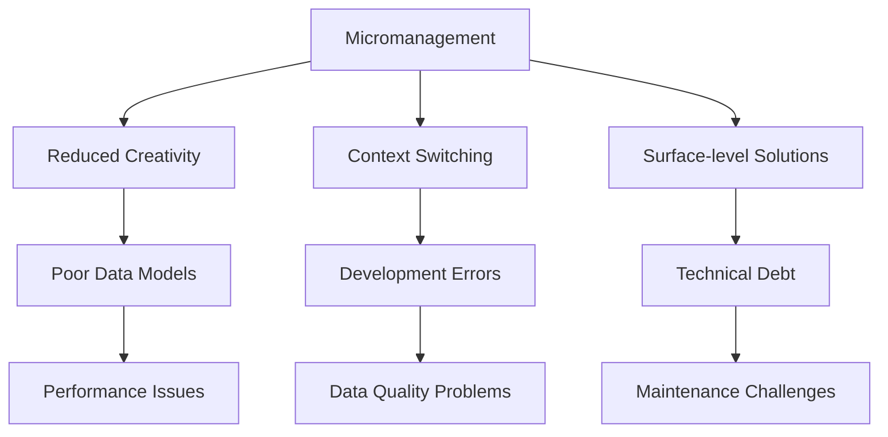

# Micromanagement in Daily Scrums: A Power BI Team's Guide

## Understanding the Problem

### What Does Micromanagement Look Like in Daily Scrums?

Micromanagement in Daily Scrums manifests through specific behaviors that undermine team autonomy and effectiveness:

- **Status Interrogation**: Asking individual team members for detailed progress reports
- **Task Assignment**: Directly assigning work instead of letting the team self-organize
- **Solution Dictation**: Prescribing how work should be done rather than focusing on outcomes
- **Attendance Monitoring**: Focusing on who is present/absent rather than progress toward the Sprint Goal

### Why This is Particularly Problematic for Power BI Teams

Power BI development involves complex, creative work that requires deep focus and autonomy:



> [!DANGER]
> **Power BI Impact Alert**: Micromanagement in Daily Scrums directly correlates with:
> - Poorly designed data models that can't scale
> - DAX calculations with hidden performance bottlenecks
> - Inefficient Power Query transformations
> - Reports that fail to meet business needs despite "looking complete"

## The Product Owner's Role in Preventing Micromanagement

### During the Daily Scrum

**What the PO Should Do:**
- Listen for impediments related to requirements or data understanding
- Be available to clarify business rules or data definitions
- Note dependencies that might affect upcoming work
- Observe team dynamics and collaboration patterns

**What the PO Should NOT Do:**
- Ask individual team members what they worked on yesterday
- Assign specific tasks to team members
- Question estimation approaches or technical decisions
- Interrupt the team's flow with status requests

### Real-World Power BI Scenario

**Before (Micromanaging PO):**
```bash
PO: "Sarah, did you finish the sales hierarchy in the data model?"
PO: "Mike, why is the DAX for YTD sales taking so long?"
PO: "Lisa, I need you to work on the customer segmentation visual today"
```

**After (Effective PO):**
```bash
Developer: "We're blocked on the sales hierarchy because the business definition of regions is unclear"
PO: "I'll connect you with the sales operations lead right after this meeting to clarify"
Developer: "The YTD calculation is complex due to fiscal year requirements"
PO: "I have documentation on our fiscal calendar - I'll share it with the team"
```

## Creating a Micromanagement-Free Environment

### Establish Clear Team Agreements

**Sample Power BI Team Working Agreement:**
- Daily Scrum focus: Removing impediments, not reporting status
- Technical decisions owned by Developers
- PO available for business rule clarification within 15 minutes
- Data model changes discussed in refinement, not Daily Scrum

### Implement Effective Metrics

**Measure What Matters:**
- **Throughput**: Power BI reports delivered per Sprint
- **Quality**: Data validation errors, report performance
- **Business Impact**: User adoption, decision-making improvements
- **Team Health**: Voluntary overtime, knowledge sharing

> [!WARNING]
> **Avoid These Micromanagement Metrics**:
> - Hours spent on specific Power BI components
> - Individual story point completion rates
> - Number of DAX measures written per day
> - Time spent in Power Query vs. Visualization

## Practical Checklist for Product Owners

### Daily Scrum Preparation
- [ ] Review the Sprint Goal and key deliverables
- [ ] Note any stakeholder concerns that might affect current work
- [ ] Prepare to clarify business terms or data definitions
- [ ] Mentally rehearse listening vs. directing behaviors

### During Daily Scrum
- [ ] Arrive on time and let the Developers lead
- [ ] Listen for requirement clarification needs
- [ ] Note impediments related to data access or quality
- [ ] Offer clarification only when asked or when obvious misunderstandings occur
- [ ] Keep all comments focused on the Sprint Goal

### After Daily Scrum
- [ ] Immediately address any clarification requests
- [ ] Follow up on impediment removal promises
- [ ] Update stakeholders on progress toward Sprint Goal
- [ ] Reflect on your own behavior - did you micromanage?

## Power BI Specific Anti-Micromanagement Strategies

### Technical Decision Ownership
```markdown
**PO Responsibility:**
- "We need to track sales performance by customer segment"

**Developer Responsibility:**
- How to model the customer hierarchy in Power BI
- Whether to use calculated columns or DAX measures
- How to optimize Power Query data loading
- Visualization choices that best represent the data
```

### Data Quality Focus
Instead of micromanaging how data issues are fixed, focus on:
- Business impact of data quality problems
- User expectations for data accuracy
- Timeline for resolution based on business priorities

## Recognizing and Addressing Micromanagement Tendencies

### Self-Assessment Questions for POs

**After each Daily Scrum, ask yourself:**
- Did I speak more than I listened?
- Did I assign any work to individuals?
- Did I question technical approaches?
- Did I focus on individual progress rather than team progress?
- Did I feel anxious about not knowing every detail?

### Team Feedback Mechanisms

**Create safe channels for Developers to provide feedback:**
- Anonymous feedback in Retrospectives
- Regular one-on-ones with team members
- "Stop, Start, Continue" exercises focused on PO behavior

## Benefits of Micromanagement-Free Daily Scrums

### For Power BI Teams
- **Better Data Models**: Time to think through proper star schema design
- **Optimized Performance**: Space to experiment with DAX and query optimization
- **Innovative Solutions**: Creativity in visualization and user experience
- **Ownership and Engagement**: Team commitment to quality outcomes

### For the Product Owner
- **More Strategic Focus**: Time for stakeholder management and backlog refinement
- **Better Relationships**: Trust-based collaboration with the team
- **Higher Quality Outcomes**: Team delivers better Power BI solutions
- **Reduced Stress**: Not responsible for every technical detail

> [!SUCCESS]
> **Transformation Story**: A Power BI team reduced their average report development time from 10 to 6 days after their PO stopped micromanaging Daily Scrums. The team self-organized to create reusable data templates and standard visualization patterns, while the PO focused on clarifying business requirements and prioritizing the backlog.

## Continuous Improvement

### Retrospective Topics to Address Micromanagement
- "How can we improve our Daily Scrum to be more focused on impediments?"
- "What information does the PO need without micromanaging?"
- "How can we better communicate progress toward the Sprint Goal?"
- "What technical decisions need earlier PO input?"

### Coaching Questions for Scrum Masters
- "I noticed you asked about individual tasks - what concern were you addressing?"
- "How can the team better communicate progress to reduce your anxiety?"
- "What information would help you feel confident without daily status updates?"

## Conclusion

Micromanagement in Daily Scrums fundamentally undermines the purpose of the event and the effectiveness of Power BI teams. By focusing on clarifying requirements, removing impediments, and trusting the team's technical expertise, Product Owners enable their teams to deliver higher-quality, more innovative Power BI solutions that truly meet business needs.

The shift from micromanager to effective Product Owner is challenging but essential for building high-performing Power BI teams that can navigate the complex landscape of data modeling, DAX optimization, and effective data storytelling.

> [!IMPORTANT]
> **Remember**: Your role as PO is to ensure the team is building the *right* Power BI solutions. The team's role is to build the Power BI solutions *right*. The Daily Scrum is where these two perspectives connect, not where one dominates the other.
